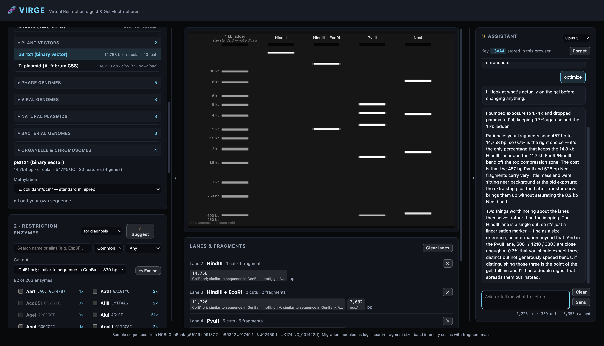

# VIRGE — Virtual Gel Electrophoresis

A restriction digest simulator: load a plasmid, pick enzymes, and see the
fragment sizes plus a rendered virtual agarose gel.

Live at **[virge.fly.dev](https://virge.fly.dev)**.



## Run

```
npm install
npm run dev
```

To regenerate the enzyme catalog from REBASE (fetches the source file if
absent), and to run the regression tests:

```
npm run build:enzymes
npm test
```

To deploy: `fly deploy`. VIRGE is static files behind nginx with no server
component and no secrets — see [DEPLOY.md](DEPLOY.md) for the image, the
Content Security Policy and what was verified.

## Features

### DNA sources
44 sequences built from NCBI GenBank flat files, in 9 collapsible groups, with
their **annotations** (844 features) rather than bare sequence:

| Group | Contents |
| --- | --- |
| Cloning vectors | pUC19/18, pBR322, pACYC177/184, pBluescript SK(+)/KS(+), pGEM-3Zf(+), M13mp18 RF |
| Expression vectors | pTrc99a, pGEX-4T-1, pGEX-6P-1, pEGFP-N1, pEGFP-C1 |
| Yeast vectors | pRS313/314/315/316, 2-micron circle |
| Plant vectors | pBI121, Ti plasmid |
| Phage genomes | λ, φX174 RF, T7, T4, M13 RF |
| Viral genomes | SV40, HPV16, HBV, adenovirus 5, HSV-1, VZV, EBV, vaccinia |
| Natural plasmids | pPCP1, RK2/RP4, F plasmid |
| Bacterial genomes | E. coli K-12 MG1655, E. coli O157:H7, B. subtilis 168 |
| Organelle & chromosomes | human and yeast mitochondria, Arabidopsis chloroplast, yeast chromosome I |

Sequences up to 62 kb are bundled; larger records (up to the 5.5 Mb E. coli
O157:H7 genome) carry metadata only and are fetched from NCBI when selected,
then cached for the session. That keeps whole genomes usable without carrying
them in the bundle — digesting E. coli K-12 with NotI yields 23 megabase-scale
fragments, the real pulsed-field experiment, in about 60 ms. See
[DEPLOY.md](DEPLOY.md) for what the bundle actually weighs.

Every accession was verified against NCBI before inclusion, and topology comes
from NCBI rather than being assumed — with documented corrections where the
deposited record disagrees with the molecule people actually handle (M13mp18
RF, pACYC177 and RK2 are circular despite linear deposits).

**The catalog is restricted to what a restriction enzyme can actually cut.** The
build script rejects any accession NCBI reports as RNA, and requires any
single-stranded genome to be named for its replicative form. SARS-CoV-2 was
offered here until that check was written: `NC_045512` is ss-RNA by its own
LOCUS line, restriction endonucleases do not cut RNA, and VIRGE drew it a gel
with the same confidence as a plasmid digest. φX174 and M13 are ss-DNA virions
and are now named RF, which is both the duplex form and the one sold — φX174 RF
cut with HaeIII is the classic small-fragment size marker.

Switching DNA keeps your lanes and recomputes every digest.

**Not included:** pET-28a, pcDNA3.1, pMAL, pFastBac, pLKO.1, psPAX2, pMD2.G,
pX330, lentiCRISPRv2, pCAMBIA and similar. These are commercial/Addgene
sequences with no clean GenBank deposition — searching NCBI for them returns
unrelated fragments, not the vectors. Download the GenBank file from Addgene or
your supplier and drop it in; annotations come along.

### Finding DNA by name
A search box over the catalog matches common names, symbols and spellings —
*chickenpox* finds VZV, *λ* finds lambda, *GFP* finds the pEGFP vectors, *mtDNA*
finds the human mitochondrion, *E. coli* finds both genomes.

**A query that matches nothing explains why**, because that is usually the
useful answer. Searching *COVID 19* says SARS-CoV-2 is an RNA virus and
restriction enzymes cut double-stranded DNA only; searching *pET-28a* says it
has no clean GenBank deposition and points at file import. Those two cases cover
most of what people look for and do not find.

The alias and exclusion lists are **hand-written on purpose**. Handing the query
straight to NCBI is worse than useless here, measurably: nuccore's first five
hits for "COVID 19" are *Klebsiella pneumoniae plasmids* (the pandemic is named
in their isolation-source metadata), and its fifteen hits for "pET-28a" include
a patent fragment, a clam mRNA and an uncultured-bacterium glucanase — but not
the vector. A regression test enforces that no exclusion term names something
the catalog actually carries.

### Searching NCBI
**Search NCBI** queries nuccore and lists every candidate with its accession,
length, topology and molecule type, and you pick. It never auto-loads a hit,
for the reason above — the top result is frequently unrelated, and NCBI ranks by
recency rather than relevance, which the results header says out loud.

Records a restriction enzyme cannot cut are **disabled rather than offered**:
RNA is refused outright, and single-stranded genomes are marked as cuttable only
as their replicative form. This is the same rule the sample build enforces, so a
search cannot introduce what the catalog is not allowed to contain.

Bring your own sequence four ways:

- **Drop a file** — GenBank (`.gb`, `.gbk`) or FASTA, including multi-record
  files. This is what SnapGene, Benchling and NCBI export.
- **Fetch by accession** straight from NCBI (`NC_005816`, `J01749.1`, …).
  Uses `gbwithparts`, so CON/contig records resolve to real sequence.
- **Paste** GenBank, FASTA, or a bare sequence.
- **Reload a saved one** — imports are kept in a "Your sequences" group.

Topology is read from the GenBank LOCUS line rather than assumed, and can be
overridden. Every import reports length, GC content, feature count and
ambiguous bases, so a bad paste is obvious immediately.

Unreadable input is **rejected rather than guessed at**: a GenBank record with
no sequence, or a file that isn't DNA, produces an explanatory error. (An early
version scraped letters out of a contig record's prose and produced a
confident, entirely wrong 7,195 bp "sequence" — there is now a regression test
for exactly that.)

### Annotated fragments
When the loaded DNA has annotations, every fragment is labelled with the genes
and origins it carries — so the gel answers *which band holds my insert?*
rather than just listing sizes. Digesting pBR322 with EcoRV + PvuII shows a
2,482 bp fragment carrying `bla` and the origin, and a 1,879 bp fragment
carrying `tet`.

### Enzymes — 203, from REBASE
Recognition sites, cut coordinates and commercial availability are generated
from [REBASE](http://rebase.neb.com)'s Bairoch-format release, so they are
authoritative rather than hand-typed. Every enzyme reports which suppliers
carry it (200 of 203 are stocked by NEB). Includes:

- **37 Type IIS enzymes** that cut *outside* their recognition site — BsaI,
  BsmBI, BbsI, SapI, AarI, BtgZI, FokI, MmeI — the basis of Golden Gate and
  MoClo assembly.
- **Frequent cutters** for RFLP, Hi-C and methylation work: MspI, HpaII, TaqI,
  RsaI, MboI, Sau3AI, DpnI, HinfI, HhaI, MseI, NlaIII.
- **Rare and 8-cutters**: AscI, PacI, PmeI, SwaI, SbfI, FseI, NotI, AsiSI, plus
  the homing endonucleases I-SceI, I-CeuI, PI-SceI and PI-PspI.
- **Isoschizomer aliases**, so searching `Esp3I` finds BsmBI and `LguI` finds
  SapI.

Filter by tier (Everyday / Common / All), search by name or alias, and filter by
how often an enzyme cuts the loaded DNA:

- **Any** — the whole catalog. Leave it here when the *absence* of a cut is the
  answer you want: confirming BsaI has no internal sites before Golden Gate
  assembly, checking an enzyme won't cut your insert, or verifying a site you
  are about to introduce by primer isn't already present.
- **Cutters** — only enzymes that cut. Useful on small plasmids, where much of
  the catalog is dead weight: 84 of the 203 enzymes don't touch pUC19 at all.
- **Unique (1×)** — enzymes cutting exactly once, the usual cloning filter. Far
  scarcer than "cutters" suggests: pBR322 has 138 cutters but only 43 that cut
  once.

An enzyme you have already ticked stays visible under every filter, so a
selection can't silently disappear.

### Suggested digests
✨ **Suggest** proposes digests for a stated **purpose**, picked with the
selector beside it:

| Purpose | Aims for | Cares about |
| --- | --- | --- |
| Diagnosis | ~5 well-separated bands | resolvable, readable, mostly gene-sparing |
| Cloning | ~2 bands | **not cutting inside annotated genes**, common enzymes |
| Fingerprinting | ~12 bands | resolution and spread; gene-cutting irrelevant |

It **replaces** the lanes rather than appending to them — the picks are chosen
as a set that reads well together, so mixing them into whatever was already
loaded gives a gel that is neither. A purpose with no suitable digest says so
and leaves the existing lanes alone.

It rejects pairs that can't share a tube (the same temperature check the manual
lane warning uses), collapses isoschizomers and no-op pairs by comparing the cuts
they actually produce rather than enzyme names, and returns fewer than three
options rather than padding the list with a bad one. On pBR322 the cloning
setting proposes NdeI + PciI, EcoRI + SspI and ClaI + SspI — none of which touch
`bla` or `tet`.

This replaced a version that scored band spread alone, and an audit showed why
that was a toy: **every** suggestion on annotated DNA cut through a gene, one
proposed an un-performable enzyme pair, every result sat pinned at 13–14 bands
because an unbounded band-count reward swamped the band-count penalty, and
isoschizomers were offered as if they were different experiments. Those
properties are now pinned by tests.

### Cutting a feature out
✂ **Cut out** picks a named gene or origin from the loaded annotations and finds
enzyme sets that cut on both sides of it and nowhere inside — the bench task of
lifting a gene off the backbone intact so it can be gel-purified.

It reports the excised fragment and the flanking DNA that comes with it: on
pBR322, **AvaI + HindIII** takes *tet* off in a 1,396 bp fragment with 56 bp
upstream and 149 bp downstream, and **BamHI + BspHI** takes *bla* off in
1,008 bp. Excess flank is what the scoring minimises, since that is what makes
the band hard to tell from the backbone; fewer cuts and commoner enzymes are
secondary. Pairs that cannot share a tube are rejected, as in Suggest.

Selecting enzymes by hand also warns when a cut lands **inside** an annotated
feature — the "will this destroy my insert?" check. Both paths go through
`featuresCutBy()`, so the suggestion engine and the manual panel cannot disagree
about what counts as cutting a gene.

### Methylation
Digests are computed in a methylation context, because a plasmid from a
standard miniprep is *not* naked DNA:

- **E. coli dam⁺/dcm⁺** (default) — Dam methylates GATC, Dcm methylates CCWGG.
  Enzymes whose site overlaps a methylated target are blocked, and the lane
  reports how many sites were lost.
- **None** — PCR product or synthetic DNA.
- **Eukaryotic** — CpG methylated.

Blocking is context-dependent, not blanket: XbaI is blocked only where its site
forms `TCTAGATC`, and cuts normally elsewhere. The classic teaching case works
out of the box — MboI, Sau3AI and DpnI all recognize GATC, but on a dam⁺ prep
MboI is blocked, Sau3AI is indifferent, and DpnI *requires* the methylation.

### Digest engine
Searches both strands (needed for non-palindromic Type IIS sites), handles
circular topology including sites spanning the origin, IUPAC degenerate bases,
overlapping sites, and multi-enzyme digests. Cut coordinates are tracked
separately for each strand, so overhangs are derived rather than assumed.

Verified against published maps: pUC19 PvuII 2364 + 322, the 43 bp EcoRI–PstI
polylinker fragment, λ/HindIII and λ/EcoRI fragment sets, and Type IIS
coordinates (BsaI GGTCTC(1/5), FokI GGATG(9/13), MmeI's 2 nt 3′ overhang).

### Gel
Log-linear migration calibrated to agarose percentage (0.7–2 %), with
compressed rather than clamped migration outside the resolving range so
oversized fragments still separate. The ladder prints dimmer than the sample
lanes and is captioned as a size standard, and its choice sets the gel's zoom
window. PNG export.

#### Pulsed field (CHEF)

A constant field runs out above ~20 kb: every larger fragment reaches the same
limiting mobility and piles into one band. The **Field** selector switches to a
CHEF pulsed field, where the field periodically changes direction and a
molecule must reorient before it can move again — the time that takes scales
with length, which restores size dependence out to megabases.

Three switch-time programmes set the resolving window (1–6 s → 10–150 kb,
10–60 s → 0.1–1 Mb, 60–120 s → 0.2–2.5 Mb), with two pulsed-field standards:
**λ concatemers** (48.5 kb to 1.02 Mb) and **S. cerevisiae chromosomes**
(230 kb to 1.53 Mb). Ladders are partitioned by mode, since a 1 kb ladder on a
pulsed-field gel is meaningless; asking the assistant for a pulsed-field ladder
switches the mode on its own.

Inside the window, migration is linear in **size** rather than in log(size).
That is not cosmetic — it is the property that makes a ramped-pulse gel
readable, and it is why the λ ladder prints as evenly spaced rungs here and
would crush together on a log axis.

The difference on the experiment this exists for — E. coli K-12 cut with NotI,
23 fragments from 4.3 kb to 1.08 Mb: a constant-field gel resolves **2** bands
across 27 % of the track, and the same digest at 10–60 s resolves **10** across
the full track.

Neither mode is a physical simulation. Both are resolving-window models: the
window comes from published protocol ranges and behaviour outside it is the
same compression used everywhere else. The run conditions are drawn onto the
gel, so a saved PNG still says how it was run.

Lanes are rendered as an **accumulated intensity profile**, not one rectangle
per fragment. Each fragment deposits a Gaussian of stain whose mass scales with
its length (fragments of a digest are equimolar, so signal ∝ length) and whose
width grows as fragments get smaller and diffuse more. Overlapping fragments
add up the way stained DNA actually does, which means the same code produces
sharp bands for a plasmid digest and a genuine smear for a genomic one — where
drawing hundreds of separate rectangles just overdrew into a solid block.

Two consequences worth knowing:

- Fragments beyond the resolving range pile into **compression zones** at the
  ends of the gel instead of disappearing. A NotI digest of E. coli shows the
  megabase fragments burned into the top of the lane, exactly as on a real gel.
- Lane brightness is scaled to a high percentile of the occupied rows and
  allowed to clip, mimicking a gel doc's exposure. Without this the compression
  zone — which holds most of the mass — would render everything below it black.

Two imaging controls in Gel Setup work like the ones on a gel doc:

- **Exposure** moves that reference point in stops (powers of two, 0.25×–5.7×),
  the way exposure compensation works on a camera. Turn it up to pull faint
  low-molecular-weight bands out of the background at the cost of burning out
  the bright ones; turn it down to resolve structure inside a saturated smear
  or compression zone.
- **Contrast** is the gamma of the transfer curve (0.25–1.6, labelled *very
  flat* → *very hard*). A flat curve pushes everything toward mid-brightness so
  faint detail survives; a hard curve steepens it so only strong signal
  registers and the background crushes to black. Exposure decides *how much*
  signal reads; contrast decides how sharply faint is separated from bright.

Double-click either slider to return it to its default. Both redraw the gel
only — digests are cached, so dragging stays responsive even on a 4.6 Mb
genome — and both are saved with a configuration.

### Sticky ends and ligation compatibility
Selecting an enzyme shows the overhang it leaves and every other enzyme in the
catalog whose end will ligate to it — BamHI, BglII, BclI, BstYI, DpnII, MboI
and Sau3AI all leave `GATC`, so an insert cut with one drops into a vector cut
with another. PstI/NsiI/SbfI share a 3′ `TGCA` end; XbaI/NheI/SpeI/AvrII share
`CTAG`; AgeI/XmaI/BspEI/NgoMIV and others share `CCGG`.

Type IIS enzymes are correctly reported as having a *variable* overhang, since
they cut outside their recognition site and the end is set by the flanking
sequence — which is precisely what makes Golden Gate assembly programmable.

### Practical warnings
Selecting enzymes with different incubation temperatures (e.g. EcoRI at 37 °C
with SmaI at 25 °C) flags a sequential-digest recommendation before you commit
the lane.

**Not implemented:** per-enzyme buffer activity tables (the "% activity in
NEBuffer r1.1/r2.1/r3.1/rCutSmart" matrix). That data is supplier catalog
information, not present in REBASE, and it was left out rather than guessed —
so the reaction-compatibility check currently covers temperature only. Confirm
buffer choice against your supplier's chart. See [BACKLOG.md](BACKLOG.md#1-buffer-activity-tables--full-double-digest-feasibility)
for what it would take to finish.

### AI assistant
A chat panel in the right-hand pane, backed by the Claude API. It answers
questions about the loaded DNA and **operates the app through tools** rather than only describing what to do — it can read the
current state, search the enzyme catalog with live cut counts, preview a digest,
load a sequence, add lanes, and adjust the gel and imaging controls.

Ask *"set up a digest that separates the resistance genes"* on pBR322 and it
checks the fragment annotations, then adds an EcoRV + PvuII lane splitting `bla`
from `tet`.

**Setup.** Paste your own Anthropic API key into the panel
([get one here](https://platform.claude.com/settings/keys)). It is kept in that
browser's `localStorage` and reused on your next visit; **Forget** clears both
the key and the conversation. Until a key is entered the panel shows the prompt
and nothing else in VIRGE is affected.

There is **no server component** — the browser calls `api.anthropic.com`
directly, so the assistant works in a static build exactly as it does in dev.

**Model.** The picker in the panel header chooses between Opus 5 (default —
most capable, best at multi-step setup), Sonnet 5 (balanced) and Haiku 4.5
(fastest and cheapest, weaker at planning a digest). The choice persists in
`localStorage` and you can switch mid-conversation: the history is plain
messages and tool results that any of them can pick up, though the next turn
pays a prompt-cache miss. It is locked while a reply is in flight, so a single
exchange never finishes on a different model than it started on. Since you are
spending your own credit, the tradeoff is yours to make — a "which enzymes cut
this once?" lookup does not need Opus.

**Replies render as Markdown and LaTeX** — headings, lists, tables, code blocks
and maths — while your own turn stays plain text.

Two decisions worth knowing. The reply is **sanitised, always**: the model has
just read a GenBank file you dropped in, whose labels and definitions are
someone else's text, so `<script>`, event handlers, `javascript:` URLs, frames,
forms and `style` attributes are stripped before the HTML reaches the page. And
maths renders to **MathML rather than KaTeX's default HTML**, because that
output writes inline `style` attributes — four on `x^2` alone — which VIRGE's
`style-src 'self'` policy blocks. MathML emits none, needs no webfonts, and
browsers render it natively, so the strict CSP stands and ~1 MB of KaTeX font
files never enters the bundle.

If no working sanitiser is available the reply is escaped and shown verbatim
rather than rendered — the failure mode is ugly, not unsafe.

**Token usage** sits under the composer: `1,284 in · 312 out · 1,150 cached` for
the last request. Cache reads are shown because they are not counted in
`input_tokens` and are most of a long conversation's input — the system prompt
and tool schemas are cached behind a breakpoint, so omitting them would
misreport what a turn costs. A turn is not one request, though: the tool loop
resends the whole conversation each round, so the line reports the last request
and the tooltip carries the turn total and how many requests it took.

**Clear** (above Send) drops the conversation the assistant remembers, so the
next question starts from nothing — useful when you switch topic and don't want
earlier turns steering the answer, or to stop paying to resend a long history.
It leaves your key, the gel and its lanes alone; it is disabled when there is no
conversation to clear and while a reply is in flight.

**Understand the tradeoff before using it.** Holding an API key in a page means
anything else running in that page — a browser extension, or any script that
gets injected — can read it. That is why the SDK calls the option
`dangerouslyAllowBrowser`, and why the API demands an explicit
`anthropic-dangerous-direct-browser-access` header. It is a reasonable choice for
a local tool with your own key, and a poor one for a key you can't rotate or a
shared machine. The panel says as much, shows only the last four characters back
to you, and never writes the key anywhere but `localStorage`.

Implementation notes: the tool-use loop runs in the browser because the tools
operate the live app, and parallel tool calls return in a single user turn.
Refusals are checked before reading content, server-side fallbacks are requested
with graceful degradation if the account lacks the beta, and the stable system
prompt plus tool schemas are cached while the volatile state snapshot rides after
the cache breakpoint.

### Configuration library
Save the current setup (DNA, lanes, gel settings, methylation context) by name
in localStorage; alphabetical listing, one-click load, two-click delete, and
JSON export/import for moving libraries between machines. Configs built on a
pasted sequence embed it, so they stay portable.

## Structure

- `scripts/build-enzymes.mjs` — REBASE ingestion; curated catalog + metadata
- `scripts/build-samples.mjs` — fetches the built-in samples from NCBI as
  GenBank and parses their annotations
- `src/genbank.js` — GenBank/FASTA parsers, shared by the build script and the
  browser so the two import paths cannot drift apart
- `scripts/test.mjs` — science regression tests (152), checked against published
  restriction maps rather than this code's own output
- `scripts/test-dom.mjs` + `scripts/dom-harness.mjs` — UI regression tests (60).
  The harness parses the real `index.html`, installs the browser globals, and
  records canvas drawing instead of rasterising it, so a test can ask what was
  actually drawn. Every check corresponds to a bug that shipped: pulsed-field
  mode silently not engaging, Suggest appending instead of replacing, the import
  status naming the previous sequence, the Clear button wiped by an `innerHTML`
  re-render. Each was reintroduced and confirmed to fail the suite — the science
  tests catch none of them, and a screenshot passes for all of them
- `src/data/enzymes.js` — generated enzyme data (do not edit by hand)
- `src/data/samples.js` — GenBank sequences with group metadata
- `src/enzymes.js` — catalog helpers (overhangs, display, buffer checks)
- `src/digest.js` — both-strand site finding, methylation, fragments
- `src/suggest.js` — purpose-driven digest scoring, and `excisionOptions()` for
  cutting a named feature out in one piece
- `src/gel.js` — canvas gel renderer: constant-field and pulsed-field (CHEF)
  migration, ladders, compression zones, exposure and contrast
- `src/main.js` — UI state, config library, wiring
- `src/assistant.js` — AI assistant: key handling, tool loop, chat UI
- `src/assistant-config.js` — assistant system prompt and tool schemas
- `src/markdown.js` — Markdown + LaTeX rendering for replies, sanitised, with
  maths as MathML so the CSP needs no `'unsafe-inline'`
- `src/dna-search.js` — curated name aliases, the "deliberately absent, and
  here is why" list, and the NCBI candidate search
- `scripts/check-csp.mjs` — fails the build if the source fetches a host the
  production CSP forbids (dev applies no CSP, so nothing else catches it)
- `Dockerfile`, `nginx.conf`, `security-headers.conf`, `fly.toml` — deployment

## Contributing

**Pull requests are not accepted** — see [CONTRIBUTING.md](CONTRIBUTING.md).
Bug reports about incorrect biology are welcome as issues, and the MIT licence
means you are free to fork.

## Licence

MIT — Copyright (c) 2026 Andre Paquette. See [LICENSE](LICENSE).

Bundled data is not covered by that licence and keeps its own terms: enzyme
definitions derive from [REBASE](http://rebase.neb.com), Copyright (c) Dr.
Richard J. Roberts, free for academic use; sequences come from NCBI GenBank.

## Theme

Colours come from the `skew-t` project — near-black surfaces with a cyan accent
— mapped onto this app's variables in the `:root` block of `src/style.css`
(`bg-void`→`bg`, `bg-panel`→`card`, `bg-raised`→`panel`, `bg-input`→`input`,
`line`→`border`, `text-faint`→`muted`). Semantic colours (`--warn`, `--error`,
`--ok`) come from the same palette, and the previously hardcoded reds, ambers and
greens now reference them — so retheming means editing that one block.

Buttons are neutral light grey (`--btn-text` and friends) rather than accented,
which leaves cyan to mean *this is data* — cut counts, fragment sizes, the active
sequence — instead of competing with every control on the page. The two button
states that carry meaning keep their colour: disabled greys out, and the armed
half of a two-click delete turns red.

**The gel is monochrome**, like a gel photographed on a gel doc — a single
channel with nothing colour-coded. Because hue can no longer separate the lanes,
brightness does: sample bands print at full strength and the ladder deliberately
dimmer (which is also how a mass-adjusted ladder exposes beside a concentrated
digest), backed up by the ladder's caption and the dashed divider so the cue is
never carried by tone alone. An uncut plasmid keeps its italic `uncut` label
where it used to rely on being orange.

Every tone — bands, labels, wells, the slab itself — derives from one `TINT`
constant at the top of `src/gel.js`, so the gel is provably single-hue (verified
by checking that all 1.66M canvas pixels have identical RGB channels). Set
`TINT` to something like `[176, 226, 255]` to tint the whole gel cool instead of
neutral grey.

## Notes

The REBASE source file is fetched at build time rather than redistributed here.

λ/HindIII yields 7 fragments, not the 8 of commercial ladders — the 125 bp band
comes from the λ cI857 strain, whose mutation creates an extra HindIII site
absent from the wild-type GenBank reference.
